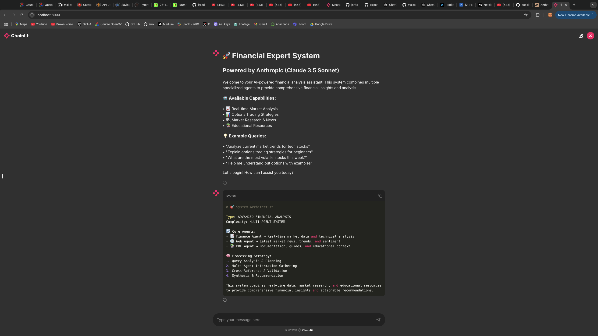
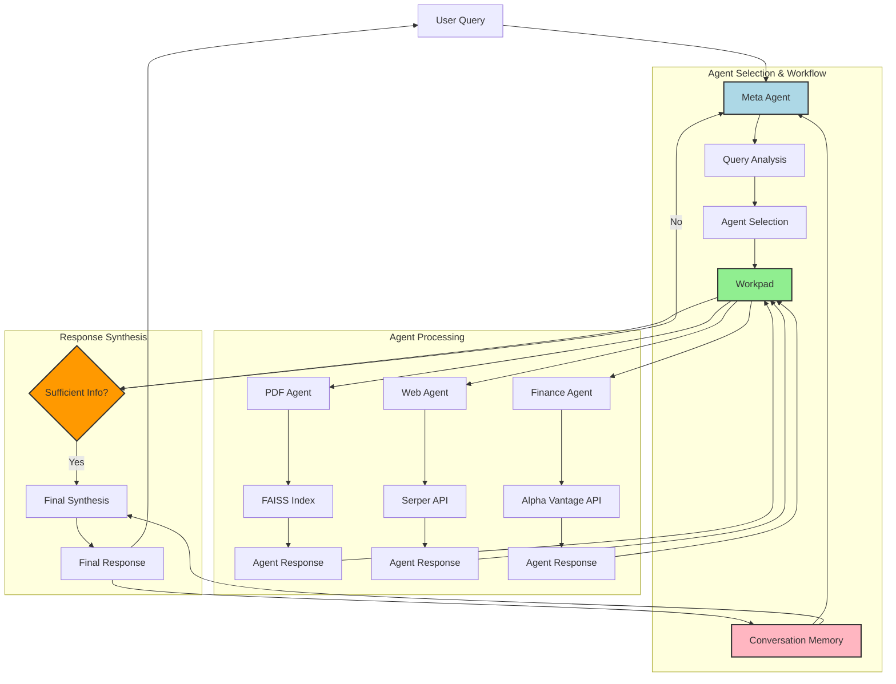

# Multi-Agent Financial Advisor with Front End




## Table of Contents
- [System Architecture](#system-architecture)
- [Overview](#overview)
- [New Features](#new-features-in-part-2)
- [Model Insights](#model-insights)
- [Testing Insights](#testing-insights)
- [Quick Start](#quick-start-tutorial)
- [Common Issues](#common-issues)
- [Future Directions](#future-directions)

## System Architecture




The system follows an enhanced workflow with memory persistence:

1. **Query Processing with Context**
   - User query is received by MetaAgent
   - Conversation memory provides context from previous interactions
   - MetaAgent analyzes query and selects appropriate agents
   - Selected agents are registered in Workpad

2. **Asynchronous Agent Execution**
   - Each selected agent processes the query using specialized tools:
     - PDF Agent: FAISS vector store for document analysis
     - Web Agent: Serper API with citation requirements
     - Finance Agent: Alpha Vantage API with ticker validation
   - Agent responses are asynchronously written to Workpad

3. **Context-Aware Synthesis Loop**
   - MetaAgent checks if gathered information is sufficient
   - Previous conversation context influences synthesis
   - If YES: Proceeds to final synthesis with memory integration
   - If NO: Returns to agent selection for additional information
   - Process repeats until sufficient information is gathered

4. **Enhanced Response Generation**
   - Final synthesis combines all agent responses with conversation history
   - Response is stored in memory for future context
   - Coherent response delivered through Chainlit UI

## Overview

This repository is part of a multi-phase project designed to democratize access to complex agent workflows. While it implements a sophisticated financial advisory system, its true purpose is educational: to provide engineers and developers with a production-ready framework for understanding and building multi-agent systems.

### Educational Focus
- Learn RAG implementation, agent orchestration, and LLM behavior in complex systems
- Understand how different-sized models perform in agent-based architectures
- Speed up AI development through practical, working examples
- Test-driven development approach ensures reliable agent interactions

### Framework Design
- Highly generalizable architecture that extends beyond financial applications
- Configurable components allow easy adaptation to different domains
- Modular design enables swapping of prompts, agents, and knowledge bases
- Production-ready patterns demonstrate real-world implementation

This phase introduces a robust front-end interface and several enhancements over the initial setup, showcasing how sophisticated AI systems can be built and understood by engineers at any level. For the basic setup instructions without the front end, please refer to [Part 1 of this project](https://github.com/cookieclicker123/Expert-Agent).

The system serves as both a working financial advisor and, more importantly, a template for understanding how to build, test, and deploy complex agent systems. By making these patterns accessible, we aim to accelerate AI development at the engineering level, moving beyond proof-of-concepts to production-ready implementations that can be adapted for various business needs.

## New Features in Part 2

- **Conversation Memory**: Enables context retention across interactions.
- **API Enablement**: Supports local, Groq, and Anthropic APIs by simply changing configurations in `main.py`.
- **Chainlit Front End**: A user-friendly interface perfect for live demonstrations.
- **Improved Web Agent**: Now includes detailed citation requirements.
- **Enhanced Meta Prompt**: Better discernment of requirements and agent needs.
- **Refined Finance Prompt**: Only invoked by explicit ticker symbols, avoiding false triggers.
- **Asynchronous Processing Framework**: Demonstrates increased architectural sophistication.
- **PDF Tool**: Now functional, allowing easy addition of multiple files to improve invocation likelihood.

This phase represents a significant system revamp, addressing the lack of software formality and sophistication in Part 1. It introduces more robust agents with real-time information access, conversation persistence, and a demonstration of building a front end asynchronously.

## Model Insights

### Anthropic with Claude 3.5 Sonnet
- Demonstrates superior agent orchestration and synthesis capabilities
- Ideal for complex agentic tasks
- Robust error handling and rich technical information processing

### Local LLaMA 3.2 3B Model
- Struggles with complex synthesis tasks
- Better suited for smaller jobs like domain expertise and information retrieval
- Shows limitations in agent orchestration capabilities

### Groq with Mixtral 8x7B (~50B parameters)
- Significant improvements in consistency and structure
- Known tokenization issues with date processing
- Efficient for business optimization with proper engineering
- Cost-effective alternative for less demanding computations

### Claude
- First-in-class agent orchestration
- Impeccable planning and answer generation
- Robust to small errors and inconsistencies
- Ideal for advanced agentic tasks and future developments

## Testing Insights

Through robust testing, we've identified that:
- Micro models (3B parameters) struggle with knowledge synthesis
- Mid-size models (~50B parameters) show significant improvement but have specific limitations
- Large models (hundreds of billions of parameters) remain advantageous for complex business optimization
- Test-driven development is crucial for understanding model capabilities

## Future Directions

As we move into Part 3 (Knowledge Base) and Part 4 (Embodied Agents with Computer Vision), these insights will guide us in:
- Developing knowledge graph implementations
- Creating computer vision-based automation
- Optimizing model selection for specific tasks
- Building more sophisticated agent architectures

## Quick Start Tutorial

1. **Setup**: Follow the setup instructions in [Part 1](https://github.com/cookieclicker123/Expert-Agent)

2. **Model Selection**: 
- Models are defined in `utils/config.py`
- Default model in `expert_chat/main.py` is Anthropic
- Change provider and model_name variables for different models

In `expert_chat/main.py`:
```python
# Change these variables for different models
provider = "anthropic"
model_name = Config.model_config.anthropic_model_name
```

3. **Environment Setup**:

For Anthropic Claude (Default):
1. Sign up at [Anthropic Console](https://console.anthropic.com/)
2. Navigate to API Keys section
3. Add payment method ($5 minimum for testing)
4. Generate and copy your API key

```bash
# Add to your .env file
ANTHROPIC_API_KEY=your_key_here
```

Alternative Free Options:
- Use Groq (faster, free tier available)
- Use Local LLaMA model (completely free, lower performance)

4. **Run the Front End**:
```bash
python expert_chat/main.py
```

## Common Issues

- **Model Selection**: Ensure the model is correctly selected in `utils/config.py` and `expert_chat/main.py`.
- **Environment Setup**: Ensure the environment variables are correctly set in your `.env` file.
- **Front End**: Ensure the front end is correctly installed and configured.

## Future Directions

As we move into Part 3 (Knowledge Base) and Part 4 (Embodied Agents with Computer Vision), these insights will guide us in:
- Developing knowledge graph implementations
- Creating computer vision-based automation
- Optimizing model selection for specific tasks
- Building more sophisticated agent architectures